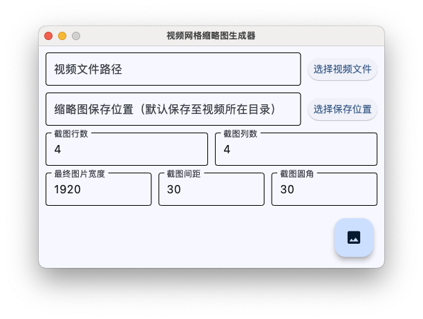
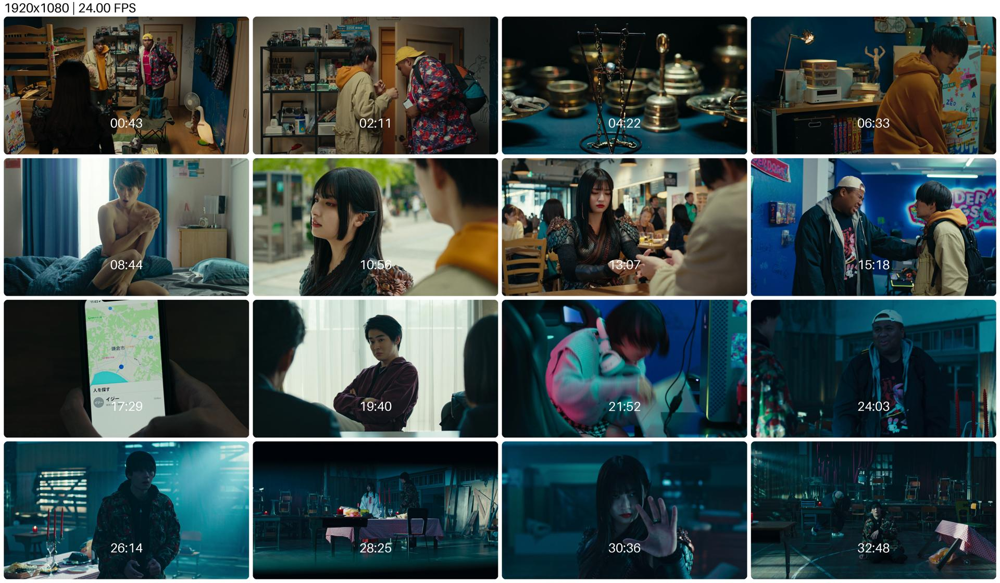

<h1 align = "center">Video Thumbnail Grid Maker</h1>

<p align = "center">
    <a href = "README.md" target = "_blank">EN</a> | <a href = "README_CN.md" target = "_blank">CN</a>
</p>

## Features

- [x] Customize the number of screenshots, for example 3×3 or 4×4;
- [x] Customize the width of the final picture (the height will be scaled automatically), set to `0` to keep the original size;
- [x] Customize the distance between the screenshots;
- [x] Customize the rounded corners of the screenshot, set to `0` to not apply the rounded corner style;
- [x] Each screenshot in the grid is labeled with its corresponding time in the video;
- [x] Support `mp4`, `mkv` and other common video formats;
- [x] A simple but sufficiently usable GUI;

## Development

Development and compilation environment:

- Python 3.13.1
- PyCharm 2024.3.1.1 (Community Edition)
- Xcode
- Flutter + Ruby + CocoaPods

Dependency Library:

```shell
pip3 install opencv-python pillow flet
```

Project structure:

- `src/main.py`: GUI layout and interaction logic;
- `src/video_thumbnail_grid_maker.py`: core logic for building thumbnails;

## Use

Run `src/main.py` in the project and adjust the parameters as required in the GUI:

1. **Click on the button to select the video file in order to read its path, I think you understand that this is a mandatory operation;**
2. The save path for the final generated grid thumbnail is, by default, saved to the directory where the video is located. You can also select the location you wish to save to by clicking the button. **Note: The path should contain a filename at the end**;
3. The number of rows in the final generated grid thumbnail, default is 4;
4. The number of columns in the final generated grid thumbnail, default is 4;
5. The width of the final generated grid thumbnail, by default, is 1920 pixels, you can manually adjust the width, and the height will be automatically adjusted proportionally;
6. The distance between screenshots is 30 by default;
7. How rounded the corners of the screenshot are, the default is 30;

Finally, click Floating Action Button in the lower right corner to generate the image!

## Demo

| Demo of the app GUI (macOS) |
|:---------------------------:|
|             |  

|  Demo of the final generated grid thumbnail  |
|:--------------------------------------------:|
|                          |
| Screenshot from 《My Undead Yokai Girlfriend》 | 

## Todo

- [ ] Package it as an executable so that it can run directly on Windows and macOS. The GUI implementation has been replaced by Flet instead of tkinter, but since the latest version of Flet is incompatible with the latest version of Flutter, and since the old version of Flutter has files that need to be translated by Rosetta, and since I don't want to install Rosetta on my Mac, I'm waiting for Flet to be adapted;
- [ ] Add multi-language support to the GUI;
- [ ] If the video has embedded subtitles, screenshots can be taken with or without subtitles;
