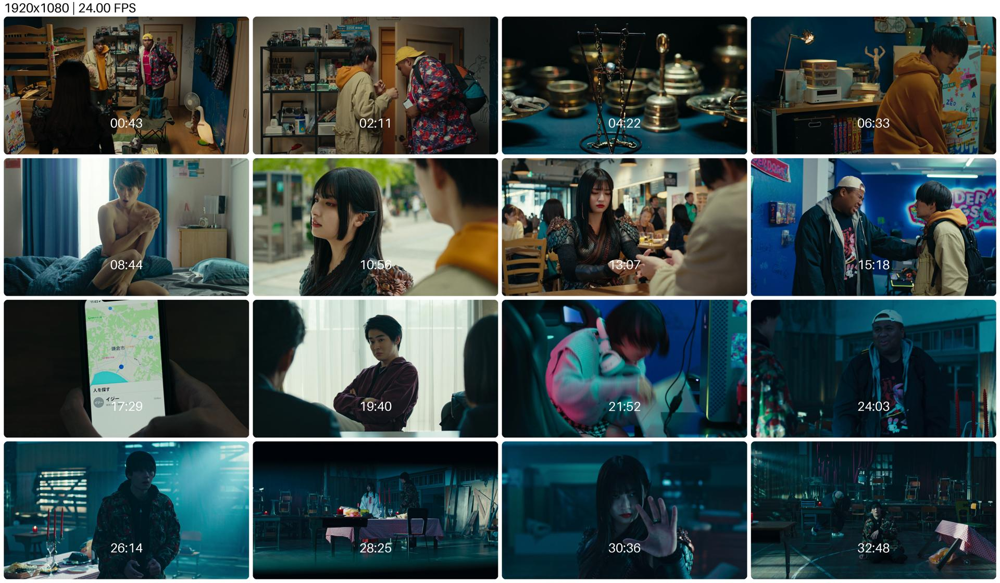

<h1 align = "center">视频网格缩略图生成器</h1>

<p align = "center">
    <a href = "README.md" target = "_blank">CN</a> | <a href = "README_EN.md" target = "_blank">EN</a>
</p>

## 废话

在很长一段时间里，我都在寻找具有给视频创建网格缩略图功能的免费播放器。在 Windows 上，PotPlayer 内置了这个功能，并且做得非常好。但是在 macOS 上，很遗憾，像 VLC 和 IINA 这两个非常出色的 app 都没有这个功能。因此我还一度有了自己开发一款播放器的念头，无奈我既不会 Swift ，也不掌握音视频开发的技能（C++、FFmpeg）。

直到昨天晚上我的脑子被门夹了，我才突然意识到：

> 其实我根本不需要特地去开发一个视频播放器，如果我只是需要从视频中截几张图然后拼接在一起的话，那我就单独开发这个功能不就行了吗……视频的播放并不是必须的。

于是便有了这个低技术力屑作（恼

## 特性

- [x] 自定义图片的数量，例如 3×3 或者 4×4 。
- [x] 自定义最终图片的宽度（高度将自动按比例调整），设置为`0`则保持原大小；
- [x] 自定义图片之间的距离；
- [x] 自定义图片的圆角，设置为`0`则不应用圆角风格；
- [x] 网格中的每张截图都会标注其在视频中对应的时间；
- [x] 支持`mp4`、`mkv`等常见视频格式。

## 使用

先安装依赖：

```shell
pip3 install opencv-python pillow
```

在执行代码前还需要进行参数设置：

```python
video_path = 'your_video_path.mp4'  # 视频文件路径
output_image_path = 'thumbnail_grid.jpg'  # 最终图片的名称及输出路径
grid_size = (4, 4)  # 图片的数量，例如此处是 4 行 4 列，总计 16 张图
padding = 30  # 图片的间距，位于边缘的图片同样需要与边缘保持这个距离
corner_radius = 30  # 圆角半径，设置为 0 则不应用圆角效果
final_width = 1920  # 最终图片的最终宽度，设置为 0 则不调整大小
```

事实上，只有`video_path`是必须要修改的。

## 效果预览

|  |
|:----------------:|
| 截图来自《我的女友是妖怪》 |  

## 后续计划

按优先级排序：

- [ ] 添加图形化界面；
- [ ] 打包为可执行文件，分发至多个平台；
- [ ] 带字幕截图；