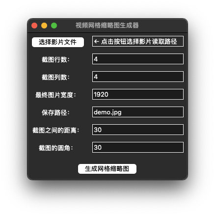

<h1 align = "center">视频网格缩略图生成器</h1>

<p align = "center">
    <a href = "README.md" target = "_blank">EN</a> | <a href = "README_CN.md" target = "_blank">CN</a>
</p>

## 废话

在很长一段时间里，我都在寻找具有给视频创建网格缩略图功能的免费播放器。在 Windows 上，PotPlayer 内置了这个功能，并且做得非常好。但是在 macOS 上，很遗憾，像 VLC 和 IINA 这两个非常出色的 app 都没有这个功能。因此我还一度有了自己开发一款播放器的念头，无奈我既不会 Swift ，也不掌握音视频开发的技能（C++、FFmpeg）。

直到昨天晚上我的脑子被门夹了，我才突然意识到：

> 其实我根本不需要特地去开发一个视频播放器，如果我只是需要从视频中截几张图然后拼接在一起的话，那我就单独开发这个功能不就行了吗……视频的播放并不是必须的。

于是便有了这个低技术力屑作（恼

## 特性

- [x] 自定义截图的数量，例如 3×3 或者 4×4 ；
- [x] 自定义最终图片的宽度（高度将自动按比例调整），设置为`0`则保持原大小；
- [x] 自定义截图之间的距离；
- [x] 自定义截图的圆角，设置为`0`则不应用圆角风格；
- [x] 网格中的每张截图都会标注其在视频中对应的时间；
- [x] 支持`mp4`、`mkv`等常见视频格式；
- [x] 简陋但是足够使用的图形界面；

## 使用

先安装依赖：

```shell
pip3 install opencv-python pillow
```

打开项目，运行`__main__.py`，在界面上根据需求进行参数调整（加粗文本为必须设置项）：

1. **点击按钮选择视频文件以读取其文件路径；**
2. 截图行数，默认为 4 行；
3. 截图列数，默认为 4 列；
4. 最终图片宽度，默认为 1920 像素，若手动调整宽度，则高度会按比例自动调整；
5. 保存路径，默认保存至`__main__.py`所在目录下，可以自行修改路径。注意路径需要包含文件名；
6. 截图之间的距离，默认为 30 ；
7. 截图的圆角，默认为 30 ；

## 效果预览

| 程序界面 |
|:----------------:|
|  |  

| 输出图片效果 |
|:----------------:|
|  |
|:----------------:|
| 截图来自《我的女友是妖怪》 |  

## 后续计划

- [ ] 编译为可执行文件，使其可以在 Windows 和 macOS 上直接运行；
- [ ] 为 GUI 添加多语言支持；
- [ ] 如果视频有内嵌字幕，则截图时可选择是否包含字幕；
